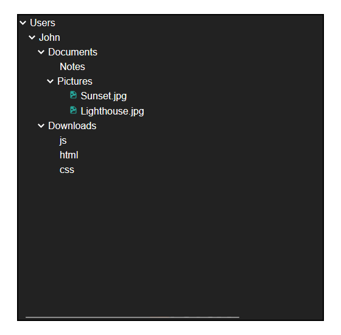

# file-tree-v2
This is a complete rewrite of file-tree v1 project. This includes much cleaner and more concise. This file tree can be easily embedded into any project with JavaScript. The tree is generated from a JSON/JS object, which makes it much more dynamic and easier to use. 
Here is the [demo](https://kachbit.github.io/FileTree-UI/demo.html)
## Embedding
Syntax:
```javascript
new fTree(json, container)
```
Include the CSS and JavaScript files (currently in the src directory)
```html
<script src="./src/ftree.js"></script>
<link rel="stylesheet" href="./src/ftree.css">
```
In your JavaScript code, make sure to include a variable set as your desired JSON or JavaScript object then call the ```fTree``` function
```javascript
// only keys of the object, not the values, will be displayed in the tree
var jsonContent = {
    Users: {
        John: {
            Documents: {
                Notes: "Some notes", // "Some notes" will not be displayed in the tree because it is not a key
                Pictures: {
                    "Sunset.jpg": "Sunset in the mountains", 
                    "Lighthouse.jpg": "View from the lighthouse",
                },
            },
            Downloads: {
                js: "JavaScript",
                html: "HTML",
                css: "CSS",
            }
        }
    }
};
new fTree(jsonContent, document.querySelector('.container')) // second parameter is the tree's container
```

**Example:**
```html
<!DOCTYPE html>
<html>
    <body>
        <div class="container" style="border: 2px solid black; width: 500px; height: 500px; margin: 50px; word-break: break-all;"></div>

        <script src="./src/ftree.js"></script>
        <link rel="stylesheet" href="./src/ftree.css" />
        <script>
            var jsonContent = {
                Users: {
                    John: {
                        Documents: {
                            Notes: "Some notes",
                            Pictures: {
                                "Sunset.jpg": "Sunset in the mountains",
                                "Lighthouse.jpg": "View from the lighthouse",
                            },
                        },
                        Downloads: {
                            js: "JavaScript",
                            html: "HTML",
                            css: "CSS",
                        },
                    },
                },
            };

            new fTree(jsonContent, document.querySelector(".container"));
            // If you want file icons:
            document.querySelectorAll('.file').forEach(file => {
                file.innerHTML = '  ` + file.innerText
            })
        </script>
    </body>
</html>
```
**Output:**<br>

